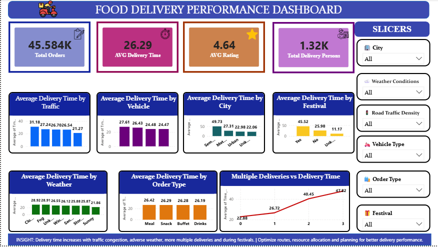

# 🚀 Food Delivery Performance Analysis 

## 📌 Project Overview
An end-to-end data analysis project focusing on food delivery performance. This project aims to identify key factors affecting delivery times and overall operational efficiency using a real-world dataset. The complete workflow includes data cleaning in Python, business problem-solving via SQL, and interactive data visualization using Power BI.

## 🎯 Business Objective
To analyze historical food delivery data to uncover patterns in delivery times, understand the impact of external factors (like weather and traffic), and provide actionable insights to optimize delivery operations and improve customer satisfaction.

## 📁 Dataset Information
* **Source File:** `Zomato Dataset.csv`
* The dataset contains raw records of food orders, delivery personnel details, weather conditions, traffic density, vehicle types, and delivery times.

## 🧹 Data Cleaning — Pandas
The raw data was preprocessed using Python (Pandas) to ensure data quality and accuracy before analysis.
* Handled missing and Null values appropriately.
* Formatted data types (e.g., converting string dates/times to datetime objects).
* Cleaned text data and removed unwanted characters from numerical columns.
* Exported the clean dataset as `food_delivery_cleaned.csv` for further analysis.

## 🔍 SQL Business Analysis

To extract deep business insights, **17 specific business questions/queries** were formulated and solved using SQL. 

**(Note: Here are the 17 business queries analyzed in this project):**

**1. Overall Delivery Performance:** 
* **Question:** How many total orders are there, and what is the average delivery time?
* **Insight:** The dataset contains 45,584 food delivery orders, with an average delivery time of 26.29 minutes.

**2. Traffic Impact on Delivery Performance:**
* **Question:** How does traffic density affect the average delivery time?
* **Insight:** Jam traffic has the highest average delivery time at 31.18 minutes, while Low traffic has the lowest. High congestion is associated with longer delivery times.

**3. Weather Impact on Delivery Performance:**
* **Question:** How do weather conditions affect the average delivery time?
* **Insight:** Cloudy and Fog conditions have the highest average delivery times, indicating weather directly impacts delivery efficiency.

**4. Vehicle Impact on Delivery Performance:**
* **Question:** How does the type of vehicle affect the average delivery time?
* **Insight:** Motorcycles have the highest average delivery time at 27.61 minutes, while Electric Scooters are faster.

**5. Order Type Impact on Delivery Performance:**
* **Question:** How does the type of order affect the average delivery time?
* **Insight:** The average delivery time is very similar across all order types, ranging from 26.19 to 26.42 minutes, suggesting order type has very little impact on speed.

**6. City Impact on Delivery Performance:**
* **Question:** How does the city segment affect the average delivery time?
* **Insight:** Among the larger and more representative segments, Metropolitan has the highest average delivery time at 27.31 minutes.

**7. Festival Impact on Delivery Performance:**
* **Question:** Does festival status affect the average delivery time?
* **Insight:** Festival orders have a much higher average delivery time of 45.52 minutes compared to non-festival orders at 25.98 minutes.

**8. Multiple Deliveries Impact on Delivery Performance:**
* **Question:** How does the number of multiple deliveries affect the average delivery time?
* **Insight:** Average delivery time increases as the number of multiple deliveries increases, peaking at 47.82 minutes for 3 multiple deliveries.

**9. Delivery Person Ratings Impact on Delivery Performance:**
* **Question:** How does delivery person rating relate to average delivery time?
* **Insight:** (Analyzed the correlation between delivery times and customer ratings).

**10. Delivery Time Range Analysis (30 to 40 mins):**
* **Question:** How many orders took between 30 and 40 minutes?
* **Insight:** A total of 10,782 orders (approx. 23.65%) fall within the 30 to 40-minute window. 

**11. Fast Deliveries Performance (Within 20 mins):**
* **Question:** How many orders were delivered within 20 minutes?
* **Insight:** 14,149 orders (approx. 31.04%) were successfully fulfilled within 20 minutes, meeting ultra-fast delivery standards.

**12. Delayed Deliveries Analysis (More than 40 mins):**
* **Question:** How many orders took more than 40 minutes?
* **Insight:** 4,037 orders (approx. 8.86%) experienced severe delays exceeding 40 minutes, largely driven by festivals, severe traffic, and adverse weather.

**13. Specific Categories using IN Operator:**
* **Question:** What is the average delivery time for Motorcycle and Scooter deliveries?
* **Insight:** Between the two primary motorized two-wheeler categories, scooters are delivered faster on average by comparison.

**14. Vehicle Categories Identification using DISTINCT:**
* **Question:** What are the different types of vehicles used for delivery?
* **Insight:** The delivery fleet operates across 4 distinct vehicle categories: motorcycles, scooters, electric scooters, and bicycles.

**15. Pattern Matching using LIKE Operator:**
* **Question:** How many delivery-person IDs start with a specific pattern (e.g., 'DE%')?
* **Insight:** Evaluated prefix patterns for targeted data validation.

**16. Traffic Conditions with High Order Volumes (HAVING Clause):**
* **Question:** Which traffic conditions have more than 5,000 orders?
* **Insight:** Using the HAVING clause isolated the top 3 dominant operations: Low, Jam, and Medium traffic. These account for over 89% of all delivery operations.

**17. Traffic Conditions Exceeding Overall Average Time (SUBQUERY):**
* **Question:** Which traffic conditions have an average delivery time greater than the overall average delivery time?
* **Insight:** Jam conditions perform worst, exceeding the dataset global average (26.29 mins) by nearly 5 minutes per order. 

## 📊 Power BI Dashboard
 

**Key Performance Indicators (KPIs):**
* **Total Orders:** 45.584K
* **AVG Delivery Time:** 26.29 mins
* **AVG Rating:** 4.64 ⭐
* **Total Delivery Persons:** 1.32K

**Visuals & Filters (Slicers):**
* **Slicers:** City, Weather Conditions, Road Traffic Density, Vehicle Type, Order Type, Festival.
* **Charts:** Average Delivery Time analyzed by Traffic, Vehicle, City, Festival, Weather, and Order Type.
* **Trend Analysis:** Multiple Deliveries vs. Delivery Time (Line Chart).

## 💡 Key Business Insights
* Delivery time significantly increases during traffic congestion and adverse weather conditions.
* Festivals and multiple deliveries per trip directly cause spikes in average delivery times.
* **Recommendation:** Optimize routing, allocate resources dynamically during peak traffic/festivals, and improve planning for multiple deliveries to enhance overall delivery performance.

## 🛠️ Tools & Technologies
* **Python (Pandas):** Data Cleaning, EDA
* **SQL:** Data Aggregation and Analytical Querying
* **Power BI:** Data Visualization & Dashboarding
* **Jupyter Notebook:** Code execution and documentation

## 🔄 Project Workflow
1. **Data Collection:** Gathered raw data (`Zomato Dataset.csv`).
2. **Data Cleaning:** Processed via Pandas (`food_delivery_pandas.ipynb`).
3. **Data Analysis:** Queried using SQL (`Food_Delivery_Analysis.ipynb`).
4. **Data Visualization:** Built Dashboard (`food_delivery_performance_dashboard.pbix`).

## 📂 Project Files Explanation
* `Zomato Dataset.csv`: The initial raw data file.
* `food_delivery_pandas.ipynb`: Python code for Data Cleaning.
* `food_delivery_cleaned.csv`: The finalized clean dataset ready for analysis.
* `Food_Delivery_Analysis.ipynb`: SQL queries and business logic execution.
* `food_delivery_performance_dashboard.pbix`: The final Power BI interactive dashboard.
* 'Dashboard_Screenshot.png': An image preview of the final Power BI dashboard.
* * 📄 **Food Delivery performance Analysis_Documentation.pdf**: The complete professional project report containing detailed Exploratory Data Analysis (EDA), SQL business queries, visualizations, and actionable insights.
  
## 🏁 Conclusion
This comprehensive analysis demonstrates how data-driven approaches can identify operational bottlenecks in food delivery systems. By leveraging Python, SQL, and Power BI, the project provides a clear roadmap for improving delivery efficiency and customer satisfaction.
